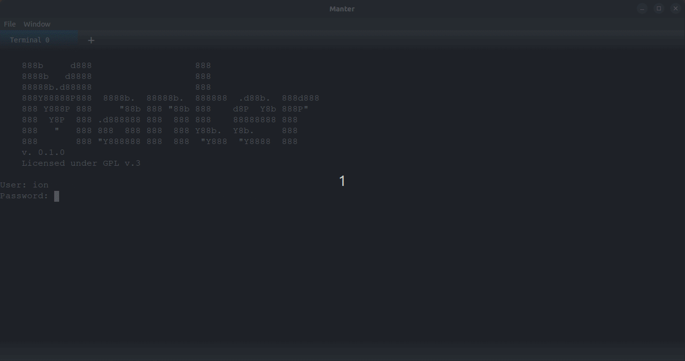

[](https://github.com/iondodon/manter/blob/main/CODE_OF_CONDUCT.md)
[](https://github.com/iondodon/manter/blob/main/CONTRIBUTING.md)

# Manter

<p align="center">
  
</p>

Manter is a project aimed at enhancing the terminal experience by offering features such as autocomplete suggestions, current branch display, reusable scripts, and more. The terminal is built with Svelte for front-end flexibility and Rust for back-end performance. The core framework is based on Tauri.

Currently, Manter supports limited command suggestions (cd, ls). To expand this library, add commands to `src/cli/library/library.ts`. Custom script-based suggestions are also available, such as listing available branches after typing "git checkout" and pressing Space.

Think of Manter as an IDE for your terminal, as opposed to traditional terminals that function like simple code editors. Contributions, ideas, and suggestions are welcome - feel free to open issues for suggestions and bugs.

### Learn how to add more suggestions in the [project's WIKI](https://github.com/iondodon/manter/wiki).

## Download the installer from the [releases section](https://github.com/iondodon/manter/releases)

## Community

[Join our Discord server](https://discord.gg/k4FFFPK3ZR)

## Contribution

[Contribution guide](https://github.com/iondodon/manter/blob/main/CONTRIBUTING.md)

## Setting up a local development environment

_Thank you for considering contributing to Manter. Your support helps make it a great tool._

1. Install NodeJS v18.4.0
2. Install Rust v.1.67.1
3. Clone the repository
4. Install dependencies with `npm install`
5. Launch the application in dev environment with `npm run tauri dev`

Keep the application running in the dev environment to see code changes in real-time. If the back-end code changes, the application will restart.

Build the installer using `npm run tauri build`. This will create an installer for your current operating system. Manter can be built for Linux, MacOS, and Windows.

## user_scripts

User scripts run each time the prompt appears, displaying information in the bottom bar. Place scripts in the `~/.manter.json` file under the `user_scripts` key. Use the following file locations:

- Windows: `C:\Users\{username}\.manter.json`
- MacOS: `/Users/{username}/.manter.json`
- Linux: `/home/{username}/.manter.json`

Format scripts in JSON as shown in the example below.

```json
{
  "default_login_user": "ion",
  "user_scripts": {
    "cwd": "$(pwd)",
    "git": {
      "currentBranch": "$(git rev-parse --abbrev-ref HEAD 2> /dev/null )"
    }
  },
  "useWebGL": false
}
```


## License

Manter is licensed under [GPLv3](https://github.com/iondodon/manter/blob/main/LICENCE.txt).
