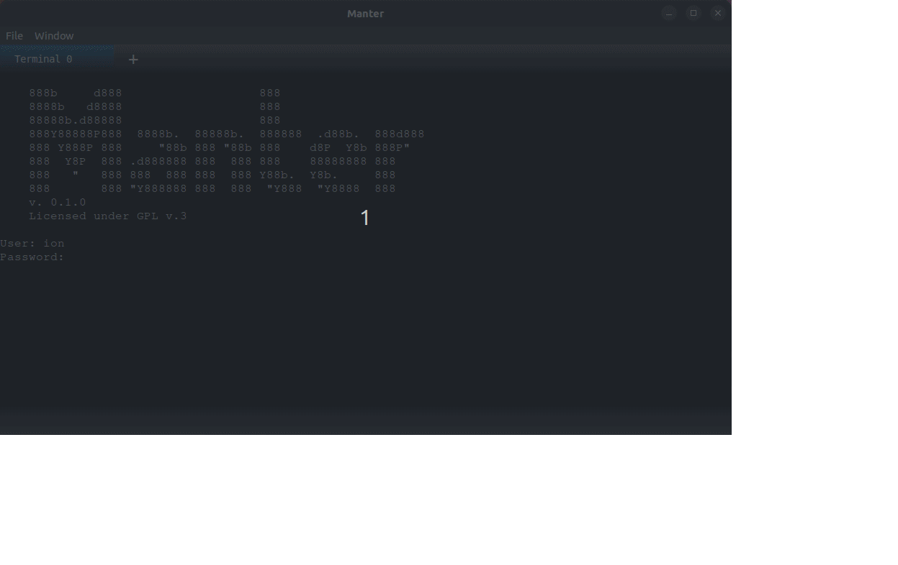

[](https://github.com/iondodon/manter/blob/main/CODE_OF_CONDUCT.md)
[](https://github.com/iondodon/manter/blob/main/CONTRIBUTING.md)

# Manter

<p align="center">
  
</p>

This project aims to create a terminal with functionalities that improve the experience of using terminals. Examples of useful functionalities would be autocomplete suggestion, showing the current branch of a project, prepared scripts that can be reused, and others. You can come up with your ideas. The project uses technologies such as Svelte on the front-end, which offers flexibility regarding the implementation of the interface. On the back-end side, the most important part is the PTY. All the back end is implemented in Rust. The basic framework of the project is Tauri.

A good analogy to understand the purpose of this project is the following - traditional terminals are like simple code editors while this terminal is like an IDE.

Anyone is welcome to contribute to this project with and ideas. Imagine the terminal you would like to use. Feel free to open any issue with suggestions and bugs.

### Read about the implementation detail in the project's [WIKI](https://github.com/iondodon/manter/wiki) .

## Download the installer

[For Linux](https://drive.google.com/file/d/10pmaz8LY0j3ZchBijYRbOsIrP1v4wozo/view?usp=share_link)

[For MacOS](https://drive.google.com/file/d/18qUd4hjXZ9uw9tr7thZa1eKY25XHpxqh/view?usp=share_linkß)

[For Windows](https://drive.google.com/file/d/1z91rs_LmJ1d6qTiv4kYABO7WW8bNcYMV/view?usp=share_link)

## Community

[Discord server](https://discord.gg/k4FFFPK3ZR)

## Contribution

[Contribution guide](https://github.com/iondodon/manter/blob/main/CONTRIBUTING.md)

## Setup local development environment

_First off, thank you for considering contributing to Manter. It’s people like you that can make Manter a great tool._

1. install the latest LTS NodeJS

2. install the latest LTS Rust

3. clone the repository

4. install the dependencies `npm install`

5. run the application in dev environment `npm run tauri dev`

You can keep the application running in the dev environment and the changes in code will be reflected in the running application. If the back-end code changes, then the application restarts to reflect the changes.

Build the installer with `npm run tauri build`.

The installer that has been built will be for the operating system that you are using. The terminal can be built for Linux, MacOS and Windows.

## user_scripts

The scripts are executed each time the prompt appears and they are used to display information in the bottom bar.

The scripts should be placed in the `~/.manter.json` file under the `user_scripts` key.

`.manter.json` location:

- On Windows - `C:\Users\{username}\.manter.json`
- On MacOS - `/Users/{username}/.manter.json`
- On Linux - `/home/{username}/.manter.json`

All scripts should be in a JSON format as presented in the example below.

```json
{
  "default_login_user": "ion",
  "user_scripts": {
    "cwd": "$(pwd)",
    "git": {
      "currentBranch": "$(git rev-parse --abbrev-ref HEAD 2> /dev/null )"
    }
  }
}
```

## Support

You can support this project [on Patreon](https://patreon.com/user?u=16335094).

## License

Manter is licensed under the [GPLv3](https://github.com/iondodon/manter/blob/main/LICENCE.txt).
